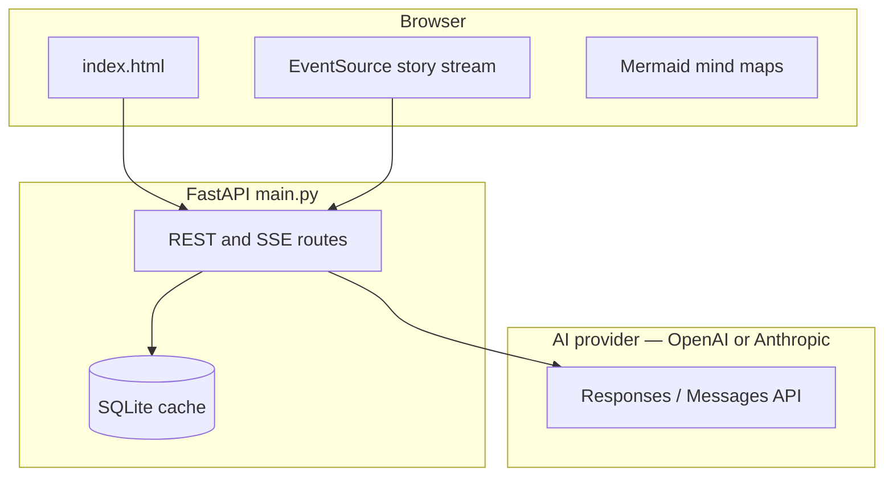

# StorySchool

An AI-powered educational app that explains school topics as hilarious comedy stories — with ASCII art, Wikipedia images, interactive flash cards, Mermaid mind maps, scored quizzes, and brain-break puzzles. Built for **CBSE students (Grades 5–10)**, narrated by "Professor Giggles."

---

## Features

| Area | What's included |
|------|-----------------|
| **Stories** | 11 genres, 4 output languages (English, Hindi, Kannada, Sanskrit), live SSE streaming, SQLite cache, Wikipedia images, NCERT chapter links |
| **Adventure** | Choose-your-own-adventure chapters with branching choices |
| **Mind map** | Mermaid diagrams generated per topic |
| **Flash cards** | 6 flip cards per topic |
| **Quiz** | 8-question scored MCQ with bronze/silver/gold tiers |
| **Upload your own** | Upload a chapter or question bank (PDF / Word / text) → a comedy story built around that chapter, or a new same-pattern question set one notch harder |
| **Doubt chat** | Homepage + post-story Q&A with streaming answers |
| **Puzzles** | Random brain breaks or topic challenges |
| **Gamification** | XP, levels, streaks, 28 badges (localStorage) |
| **Learning progress** | Per-topic path (story → mind map → flashcards → quiz), server sync |
| **Child profile** | Name, age, grade, language, reading level, interests — personalizes AI stories |
| **Story World** | Interactive story universe — chapters, scenes, in-story puzzles that unlock the plot |
| **Spaced repetition** | 1 → 3 → 7 → 14 day review for missed quiz Qs and flashcards marked “Still learning” |
| **Subject checkpoints** | Optional bonus after every 3 topics per subject: a 20-question exam (MCQ + subjective + descriptive) to test mastery and earn XP. Topics are never locked — pick any topic in any order. |
| **Accessibility** | Text size, high contrast, dyslexia font, TTS |

---

## Architecture



### Tech stack

- **Backend:** Python 3.10+, FastAPI, Uvicorn
- **AI:** OpenAI (`gpt-4o` / `gpt-4o-mini`, Responses API) **or** Anthropic Claude (`claude-sonnet-5` / `claude-haiku-4-5`, Messages API) — pick the provider and models at runtime
- **Frontend:** Vanilla HTML/CSS/JS — marked.js, Mermaid 11
- **Cache:** SQLite (`storyschool_cache.db`) for stories, flashcards, mind maps, quizzes
- **Documents:** server-side text extraction from uploads — `pypdf` (PDF), `python-docx` (Word), stdlib (text)
- **Images:** Wikipedia/Wikimedia REST API

---

## Quick start

### Prerequisites

- Python 3.10+
- An [OpenAI API key](https://platform.openai.com/api-keys) **or** an [Anthropic API key](https://console.anthropic.com/settings/keys) (either one is enough; set both to switch between them in-app)

### Install and run

```bash
git clone https://github.com/YOUR_USERNAME/story-school.git
cd story-school
python -m venv venv
# Windows: venv\Scripts\activate
# macOS/Linux: source venv/bin/activate
pip install -r requirements.txt

# Windows PowerShell — set at least one provider's key:
$env:OPENAI_API_KEY="your-openai-key"
# or use Claude instead:
# $env:ANTHROPIC_API_KEY="your-anthropic-key"
# $env:AI_PROVIDER="anthropic"
python main.py
```

Open **http://127.0.0.1:8000**

You can also switch provider and models live from the **⚙️ AI** button in the top bar — no restart needed.

### Docker

```bash
docker compose up --build
# Set OPENAI_API_KEY and/or ANTHROPIC_API_KEY in .env or the environment.
# Optionally set AI_PROVIDER=anthropic to default to Claude.
```

---

## Environment variables

| Variable | Required | Description |
|----------|----------|-------------|
| `AI_PROVIDER` | No | Default provider: `openai` (default) or `anthropic` |
| `OPENAI_API_KEY` | Conditional | Required when using OpenAI (at least one provider key must be set) |
| `OPENAI_MODEL_STORY` | No | OpenAI model for stories & adventure narrative (default `gpt-4o`) |
| `OPENAI_MODEL_FAST` | No | Cheaper OpenAI model for quiz, flashcards, mind maps, puzzles, doubt (default `gpt-4o-mini`) |
| `ANTHROPIC_API_KEY` | Conditional | Required when using Anthropic (at least one provider key must be set) |
| `ANTHROPIC_MODEL_STORY` | No | Claude model for stories & adventure narrative (default `claude-sonnet-5`) |
| `ANTHROPIC_MODEL_FAST` | No | Cheaper Claude model for quiz, flashcards, mind maps, puzzles, doubt (default `claude-haiku-4-5`) |
| `PORT` | No | Server port (default `8000`) |

At startup the app validates that the active provider (`AI_PROVIDER`) has a key; if not, it falls back to any provider whose key is set, and only errors when no provider is configured.

### Choosing the provider & models

StorySchool supports **OpenAI and Anthropic (Claude)** behind one interface. The active
provider and its two model tiers are seeded from the environment and can be changed at
runtime three ways:

- **Env vars** — `AI_PROVIDER`, plus the `*_MODEL_STORY` / `*_MODEL_FAST` variables above.
- **In-app picker** — the **⚙️ AI** button in the top bar (provider + story model + fast model, saved instantly).
- **API** — `GET /api/ai/settings` returns the current selection, the configured providers, and the model catalog; `POST /api/ai/settings` (`{provider?, story?, fast?}`) applies changes. Switching to a provider with no API key, or an empty model, returns `400`.

The runtime override is **process-global** (it applies server-wide for this self-hosted,
single-family app) and **in-memory** — it resets to the env defaults on restart.

### AI cost routing

StorySchool uses **two model tiers** to balance quality and cost:

- **Story tier** (`*_MODEL_STORY`) — comedy stories and adventure chapter narrative (streamed token-by-token)
- **Fast tier** (`*_MODEL_FAST`) — structured JSON outputs (quiz, flashcards, mind map, puzzles) plus doubt chat with NCERT grounding

Quiz, mind map, and adventure metadata use provider **JSON-schema structured outputs** to avoid parse failures. Check the resolved routing via `GET /api/ai/models` (which also reports the active `provider`).

---

## API reference

Base URL: `http://localhost:8000`

| Method | Path | Description |
|--------|------|-------------|
| `GET` | `/` | Web UI |
| `GET` | `/api/syllabus` | CBSE topics by grade |
| `GET` | `/api/genres` | Story genre list |
| `GET` | `/api/languages` | Output languages |
| `GET` | `/api/difficulties` | Easy / Medium / Hard levels |
| `GET` | `/api/ncert` | Map topic → NCERT chapter + PDF link |
| `GET` | `/api/ai/models` | Resolved model tier routing (story vs fast) + active provider |
| `GET` | `/api/ai/settings` | Current provider/models, configured providers, model catalog |
| `POST` | `/api/ai/settings` | Set provider and/or tier models (`{provider?, story?, fast?}`) |
| `GET` | `/api/explain/stream` | SSE story generation (`thinking`, `token`, `done`) |
| `POST` | `/api/explain` | Non-streaming story (cached) |
| `POST` | `/api/adventure/stream` | SSE adventure chapter (`token`, `chapter`, `done`) |
| `POST` | `/api/flashcards` | 6 flash cards |
| `POST` | `/api/mindmap` | Mermaid mind map JSON |
| `POST` | `/api/quiz` | 8-question MCQ quiz |
| `POST` | `/api/document/generate` | Upload a chapter/question bank (`multipart/form-data`: `file`, `action=story\|questions`, `grade`, …) → `{mode:"story", story}` or `{mode:"questions", question_set}` (not cached) |
| `POST` | `/api/quiz/submit` | Record score and mastery tier; optional `wrong_items` for spaced rep |
| `GET` | `/api/progress` | List learner topic progress (`learner_id` query param) |
| `POST` | `/api/progress` | Record a learning step (story, mindmap, flashcards, quiz) |
| `GET` | `/api/child-profile` | Load child profile (name, interests, reading level, goals, …) |
| `PUT` | `/api/child-profile` | Save child profile (synced per `learner_id`) |
| `POST` | `/api/story-world/start` | Generate interactive Story World for a topic |
| `POST` | `/api/story-world/answer` | Answer an in-story challenge (unlock doors, etc.) |
| `POST` | `/api/story-world/choose` | Make a branching choice with consequences |
| `GET` | `/api/child-profile/options` | Reading levels, languages, grades for the profile form |
| `GET` | `/api/spaced/rules` | Review intervals (1, 3, 7, 14 days) |
| `GET` | `/api/spaced/due` | Due review items for a learner |
| `POST` | `/api/spaced/review` | Answer a due item (correct / still learning) |
| `POST` | `/api/spaced/rate` | Rate a flashcard during study |
| `GET` | `/api/subject-gate/status` | Checkpoint progress for a subject (all topics report `unlocked`) |
| `POST` | `/api/subject-gate/exam` | Generate the optional 20-question subject checkpoint |
| `POST` | `/api/subject-gate/submit` | Submit checkpoint answers (80% clears it; no longer gates topics) |
| `POST` | `/api/adventure` | CYOA chapter |
| `POST` | `/api/ask-doubt` | Blocking doubt answer |
| `POST` | `/api/ask-doubt/stream` | SSE doubt answer |
| `GET`/`POST` | `/api/puzzle` | Brain break or topic puzzle |
| `GET` | `/api/image-search?q=` | Wikipedia thumbnail |

---

## Project structure

```
story-school/
├── main.py                 # FastAPI app, prompts, cache, routes
├── document_ingest.py      # Server-side text extraction for uploads (PDF/DOCX/TXT)
├── child_profile.py        # Child learner profile schema and AI personalization
├── story_world.py          # Story World engine (scenes, challenges, consequences)
├── spaced_rep.py           # Spaced repetition scheduling (1/3/7/14 days)
├── subject_gate.py         # Subject checkpoints every 3 topics (80% pass)
├── syllabus.py             # CBSE curriculum, genres, languages
├── requirements.txt
├── Dockerfile
├── docker-compose.yml
├── tests/test_api.py       # pytest smoke tests
├── .github/workflows/ci.yml
├── streaming_frontend_example.html
└── templates/index.html    # Single-page frontend
```

---

## Deployment

**Railway / Render / Fly.io:**

- Build: `pip install -r requirements.txt`
- Start: `uvicorn main:app --host 0.0.0.0 --port $PORT`
- Env: `OPENAI_API_KEY` and/or `ANTHROPIC_API_KEY` (optionally `AI_PROVIDER`)

**Docker:** see `Dockerfile` and `docker-compose.yml`.

SQLite cache persists in `storyschool_cache.db` — mount a volume in production for cache survival across restarts.

---

## Development

```bash
pytest tests/ -v
```

---

## Demo checklist (portfolio)

1. Select Grade 7 → Science → Photosynthesis → Anime genre
2. Watch story stream live with thinking line
3. Open Mind Map — Mermaid diagram renders
4. Take the Quiz — earn gold/silver/bronze
5. Ask a doubt — answer streams token by token

---

## License

MIT — see repository for details.
